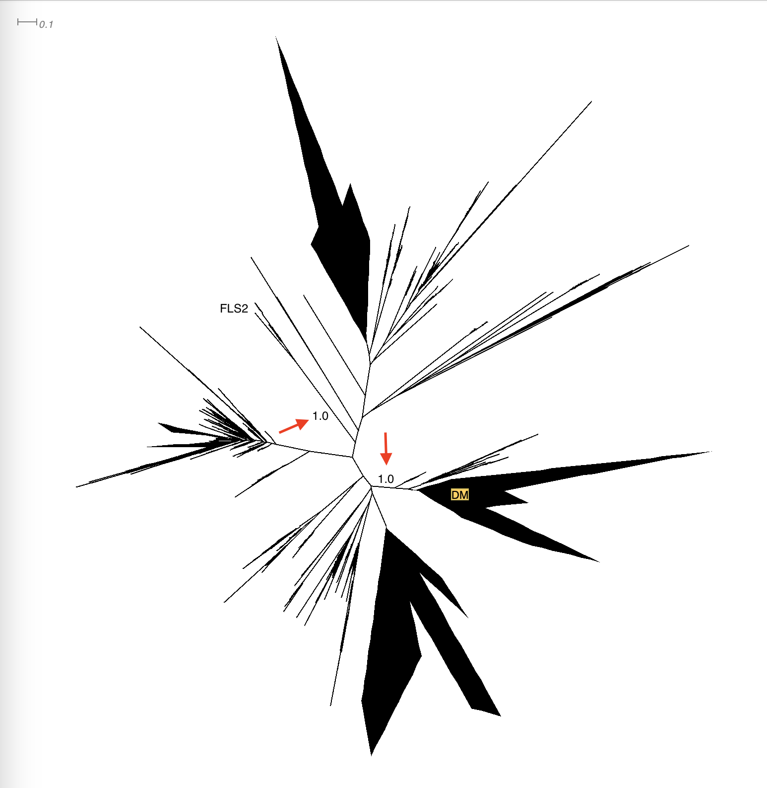
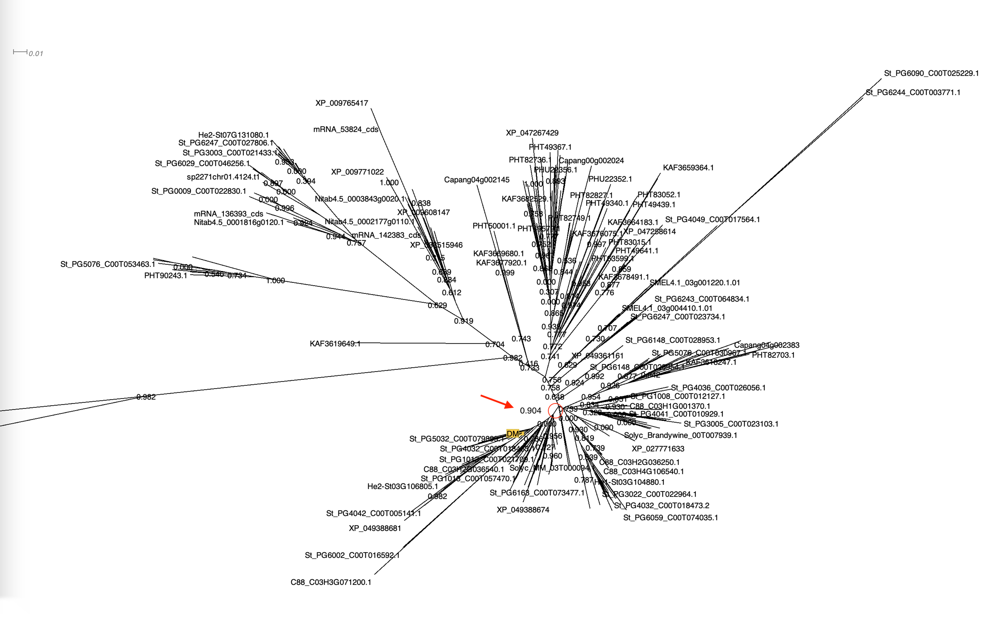

# Phylogenomics of PERU and FLS2 LRR-RK immune receptors in Solanaceae plant family
# Part three - Phylogenetic tree construction and analyses

General code for alignment and tree construction:

```bash

# alignment
mafft --anysymbol sequence.fasta > alignment.afa

# tree construction
FastTree alignment.afa > tree.newick

```

To study the phylogenetic relationships of LRR-RK sequences, we first extracted their PK domains and aligned them with the PK domains of reference LRR-RKs ([table S8](tables/table_S8.csv)) and DM (*PERU DM*) PK domain using *MAFFT*. The resulting alignment was then used to construct phylogenetic trees using *FastTree*. This was done for all four sets of sequences deposited in the supplementary material: [LRR-RKs](trees/LRR_RK.newick), [Subgroup XII](trees/XII.newick), [PERU](trees/PERU.newick), and [FLS2](trees/FLS2.newick).

To extract the PERU clade, we performed multiple iterations of alignment and tree construction. In each iteration, we identified a well-supported major branch and extracted it using *Dendroscope* (Options > Advanced Options > Extract Subnetwork...). We then realigned the extracted sequences and constructed a new tree. This process was repeated until we obtained a tree with good resolution for comparing PERU with its closely related sequences (average pairwise alignment ~77%; PK domain only):

1. Extract a well supported major branches that contain [DM](trees/DM_superclade_PK_filtered_ref.newick) (*PERU DM*) and FLS2 from the [XII subgroup phylogenetic tree](trees/XII.newick).



Only keep the sequences with PK domain sequence length of 260-280 amino acids. This is based on average length of the PK domain within this phylogenetic clade. Most sequences fall in the 260-280 amino acid range.

2. Realign the extracted sequences with Reference RKs and make a new tree. Then again, extract a well supported branch containing the DM (*PERU DM*). This clade is considered as the PERU clade but before the final filtering.




Finally, we extracted the full-length sequences for the final clade and filtered it according to the steps descibed in the methods to obtain a more concise alignment and a better overview of the phylogenetic relationships of both the PERU and FLS2 clades. The full-length sequences of PERU and FLS2 were checked for the presence of a signal peptide using `SignalP 6` and the LRRNT domain. FLS2 sequences were also filtered to remove sequences shorter than 1150 amino acids.


[Main](README.md) | [Next: 04. Data Visualization](04_Data_Visualization.md)
